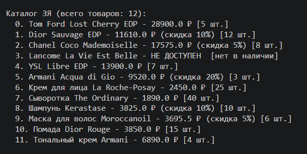
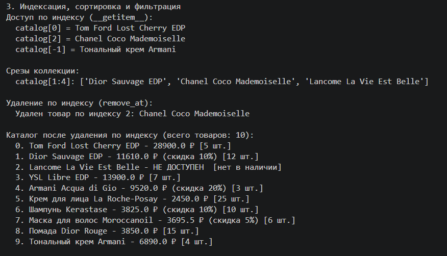
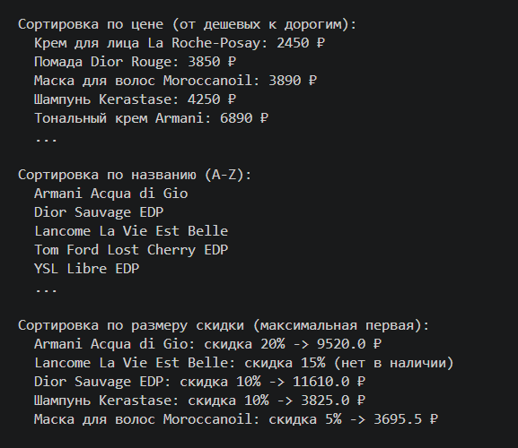
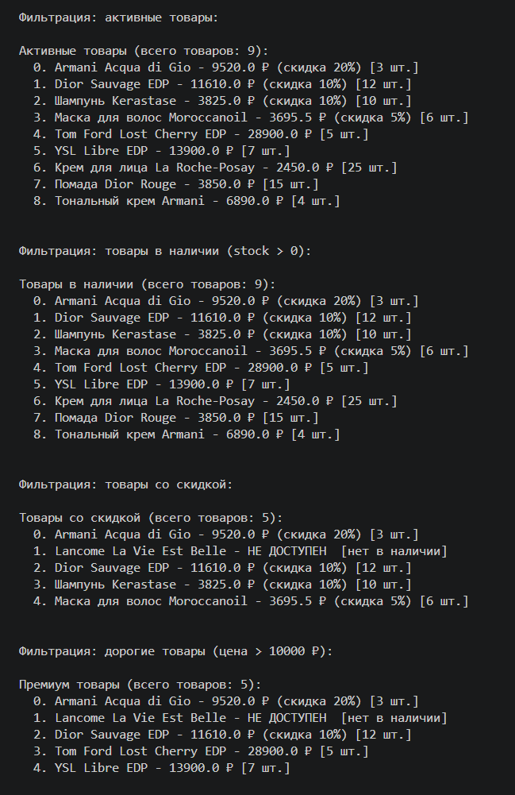
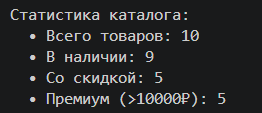

# Лабораторная работа №2

## Тема

Интернет-магазин парфюмерии и косметики «Золотое Яблоко»

## Реализованная коллекция

В данной лабораторной работе реализован класс ProductCatalog, который хранит и управляет коллекцией объектов Product.

## Описание контейнерного класса

Класс `ProductCatalog` содержит список товаров:

- добавляет товары в каталог;
- удаляет товары из каталога;
- возвращает все товары;
- позволяет искать товары;
- позволяет перебирать товары в цикле;
- позволяет получать товары по индексу;
- позволяет фильтровать товары (активные, в наличии, со скидкой, дорогие);
- позволяет сортировать и фильтровать товары.

## Что реализовано

В классе `ProductCatalog` реализованы:

хранение объектов в списке self._items;
- add(item) — добавление товара с проверкой типа и на дубликаты;
- remove(item) — удаление товара;
- remove_at(index) — удаление товара по индексу;
- get_all() — получение списка всех товаров;
- find_by_id(product_id) — поиск товара по ID;
- find_by_name(name) — поиск товаров по названию;
- find_by_category(category) — поиск товаров по категории;
- find_by_price_range(min_price, max_price) — поиск товаров по ценовому диапазону;
- sort_by_name() — сортировка товаров по названию;
- sort_by_price() — сортировка товаров по цене;
- sort_by_stock() — сортировка товаров по количеству;
- sort_by_discount() — сортировка товаров по скидке;
- get_active_products() — получение только активных товаров;
- get_available_products() — получение только товаров в наличии;
- get_products_with_discount() — получение товаров со скидкой;
- get_expensive_products(threshold) — получение товаров дороже заданной цены;
- get_by_category(category) — получение товаров выбранной категории.

## Магические методы

В контейнерном классе реализованы:

- `__len__()` — позволяет использовать `len(catalog)`;
- `__iter__()` — позволяет перебирать каталог через `for`;
- `__getitem__()` — позволяет обращаться к элементам по индексу;
- `__contains__()` — позволяет использовать оператор in;
- `__str__()` — красивый вывод каталога.

## Проверки и ограничения

В программе реализованы следующие проверки:

- в каталог можно добавлять только объекты класса `Product`;
- нельзя добавить объект неправильного типа;
- нельзя добавить дубликат товара с тем же `product_id`;
- нельзя удалить товар по несуществующему индексу;
- при отсутствии товара на складе (stock = 0) товар автоматически деактивируется;
- нельзя удалить объект, которого нет в каталоге.

## Логические операции над коллекцией

В контейнере реализованы методы фильтрации, которые возвращают новую коллекцию:

- `get_active()` — только активные товары;
- `get_available_products()` — только товары, которые есть в наличии;
- `get_products_with_discount()` — только товары со скидкой;
- `get_expensive_products(threshold)` — только товары дороже указанной цены;
- `find_by_category(category)` — товары выбранной категории.

## Сценарии работы программы 📃

## Создание товаров

## Каталог

## Базовые операции

## Поиск и итерация

## Индексация

## Сортировка

## Фильтрация

## Симуляция покупки

## Статистика

