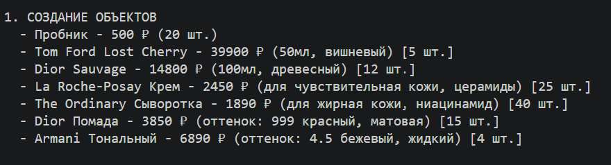
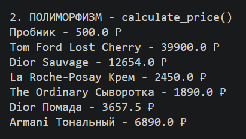
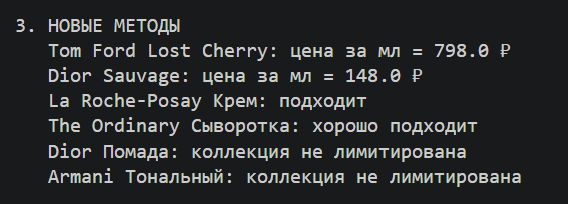
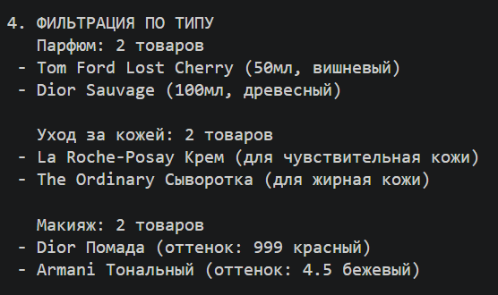
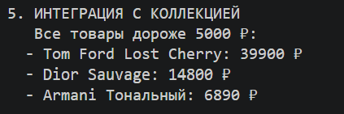
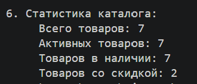

# Лабораторная работа №3

## 1. Цель работы

Освоить механизм наследования классов, научиться строить иерархию объектов, понять разницу между базовым и производным классами, научиться переиспользовать код и переопределять методы. Изучить принципы полиморфизма и научиться применять их на практике.

## 2. Описание реализованной иерархии классов

### Базовый класс - `Product `

Базовый класс `Product` представляет общую модель товара в интернет-магазине.

**Атрибуты класса:**

- currency - валюта товара (₽)

**Атрибуты экземпляра:**

- _name - название товара
- _price - цена товара
- _stock - количество на складе
- _discount - скидка в процентах
- _category - категория товара
- __product_id - уникальный идентификатор товара (приватный)
- _active - статус активности товара

**Основные методы:**

- get_final_price() - возвращает цену с учетом скидки
- reduce_stock(quantity) - уменьшает количество товара на складе
- update_available() - обновляет статус активности
- activate() / deactivate() - активация/деактивация товара
- calculate_price() - расчет итоговой цены (метод для полиморфизма)

Магические методы:

- `__str__()` - строковое представление товара
- `__eq__()` - сравнение товаров по ID
- `__lt__()` - сравнение товаров по цене
- `__repr__()` - представление для отладки

### Дочерний класс - `Perfume` (Парфюм)

Наследуется от `Product` и представляет парфюмерные товары.

**Дополнительные атрибуты:**

- _volume - объем флакона (в мл)
- _fragrance_type - тип аромата (вишневый, древесный, цветочный и т.д.)

**Новые методы:**

- get_price_per_ml() - расчет цены за 1 мл парфюма

**Переопределенные методы:**

- calculate_price() - при объеме от 100 мл действует скидка 5%
- `__str__()` - добавляет объем и тип аромата

### Дочерний класс - Skincare (Уход за кожей)
Наследуется от `Product` и представляет товары по уходу за кожей.

**Дополнительные атрибуты:**

- _skin_type - тип кожи (сухая, жирная, нормальная, комбинированная)
- _active_ingredient - активный компонент (гиалуроновая кислота, ретинол, ниацинамид и т.д.)

**Новые методы:**

- get_skin_compatibility() - определение совместимости с типом кожи

**Переопределенные методы:**

- calculate_price() - товары с активными ингредиентами дороже на 10%
__str__() - добавляет тип кожи и активный компонент

### Дочерний класс  - Makeup (Макияж)
Наследуется от Product и представляет косметику для макияжа.

**Дополнительные атрибуты:**

- _shade - оттенок (красный, бежевый, розовый и т.д.)
- _texture - текстура (матовая, жидкая, кремовая)

**Новые методы:**

- is_limited_edition() - проверка, является ли товар лимитированной коллекцией

**Переопределенные методы:**

- calculate_price() - лимитированные товары дороже на 20%
- `__str__()` - добавляет оттенок и текстуру

## Сценарии работы программы

### Сценарий 1: Единая коллекция с объектами разных типов

### Сценарий 2: Полиморфизм 

### Сценарий 3: Новые методы

### Сценарий 4: Фильтрация

### Сценарий 5: Внедрение в коллекцию

### Сценарий 6: Итог

## 4. Вывод

Были изучены и закреплены следующие концепции ООП:

### Наследование
- Создан базовый класс Product и три дочерних класса: Perfume, Skincare, Makeup
- Использован super() для вызова конструктора родителя
- Добавлены новые атрибуты и методы в дочерние классы без дублирования кода

### Полиморфизм
- Переопределен метод calculate_price() в каждом дочернем классе
- Один и тот же метод дает разные результаты для разных типов товаров
- Реализована фильтрация объектов по типу с помощью isinstance()

