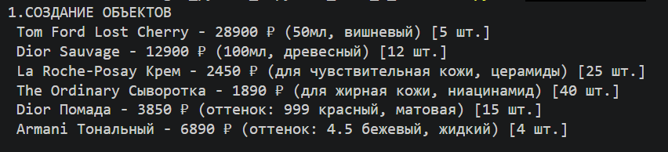
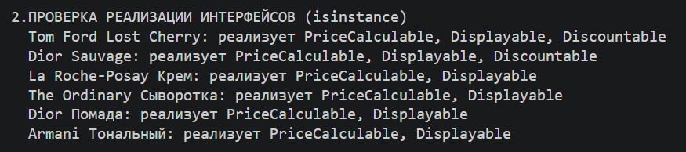
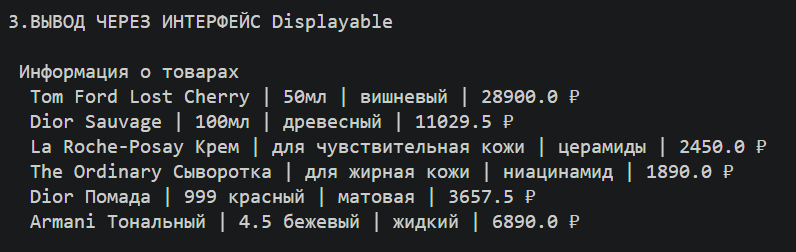
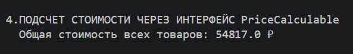
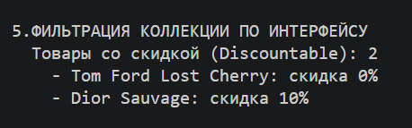
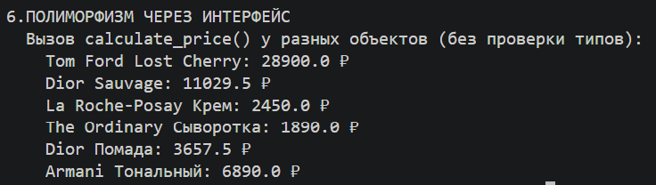

# Лабораторная работа №4

## 1. Цель работы

Изучить: интерфейсы, абстрактные классы

### Реализованная система интерфейсов на основе существующих классов

| Интерфейс | Назначение | Абстрактные методы |
|-----------|------------|-------------------|
| `PriceCalculable` | Расчет итоговой цены товара | `calculate_price()` |
| `Displayable` | Предоставление информации для отображения | `get_display_info()` |
| `Discountable` | Работа со скидками | `get_discount_percent()`, `apply_discount()` |

## 2. Описание реализованных интерфейсов

### Интерфейс `PriceCalculable`

Контракт для объектов, которые могут рассчитать свою итоговую цену с учетом всех факторов (скидки, наценки, дополнительные услуги).

**Реализация в классах:**

| Класс | Реализация метода `calculate_price()` |
|-------|----------------------------------------|
| Perfume | Цена со скидкой + дополнительная скидка 5% при объеме от 100 мл |
| Skincare | Цена со скидкой + наценка 10% при наличии активных ингредиентов |
| Makeup | Цена со скидкой + наценка 20% для лимитированных коллекций |

### Интерфейс `Displayable`

Контракт для объектов, которые могут предоставить краткую информацию для отображения в интерфейсе.

**Реализация в классах:** `get_display_info()` 

`Perfume`  - название, объем мл, тип аромата, итоговая цена

`Skincare` - название, тип кожи, активный компонент, итоговая цена

`Makeup` - название, оттенок, текстура, итоговая цена

### Интерфейс `Discountable`

Контракт для объектов, поддерживающих операции со скидками.

**Реализация в классах:**

| Класс | `get_discount_percent()` | `apply_discount()` |
|-------|-------------------------|-------------------|
| Perfume | Возвращает текущий процент скидки | Возвращает цену с учетом скидки |
| Skincare | Возвращает 0 (скидка не применяется) | Возвращает базовую цену |
| Makeup | Возвращает текущий процент скидки | Возвращает цену с учетом скидки |

### Расширение коллекции `ProductCatalog`

- `get_price_calculable()` - возвращает товары, реализующие PriceCalculable 
-  `get_displayable()` - возвращает товары, реализующие Displayable 
-  `get_discountable()` - возвращает товары, реализующие Discountable 

## Сценарий 1 - Создание объектов

## Сценарий 2 - Проверка реализации интерфейсов

## Сценарий 3 - Вывод через интерфейс Displayable

## Сценарий 4 - Подсчет стоимости через интерфейс

## Сценарий 5 - Фильтрация коллекциии по интерфейсу

## Сценарий 6 - Полиморфизм через интерфейс

