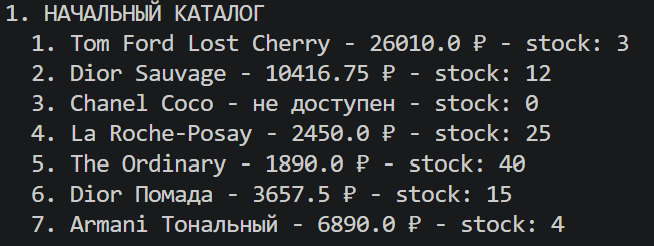
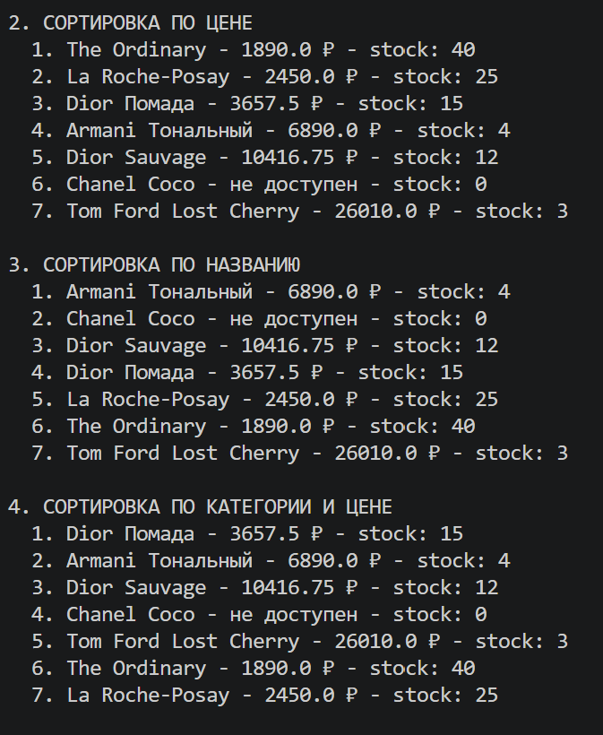
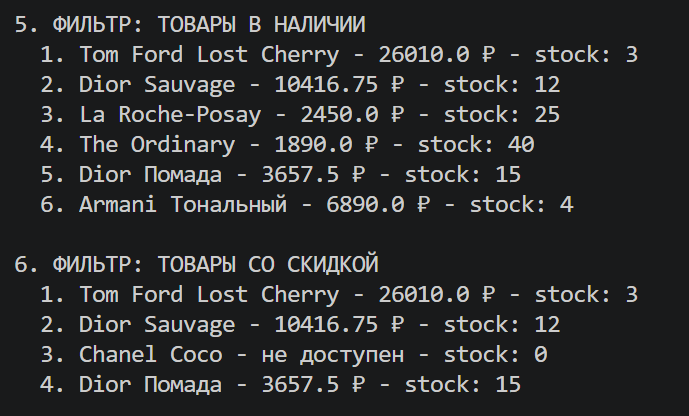
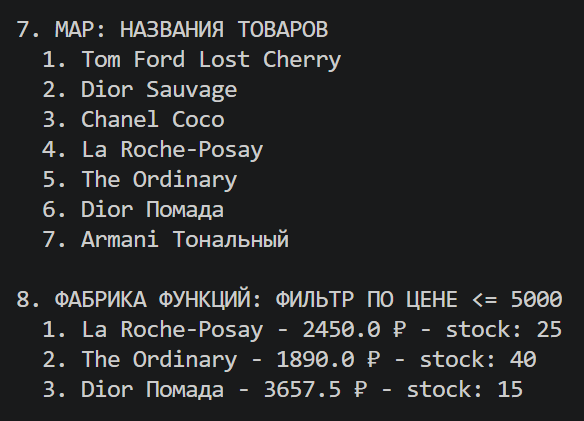
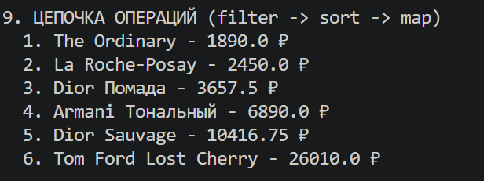
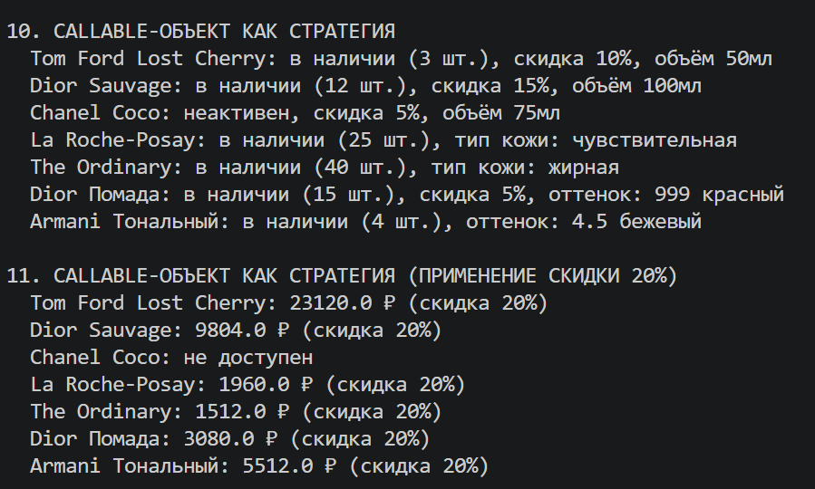
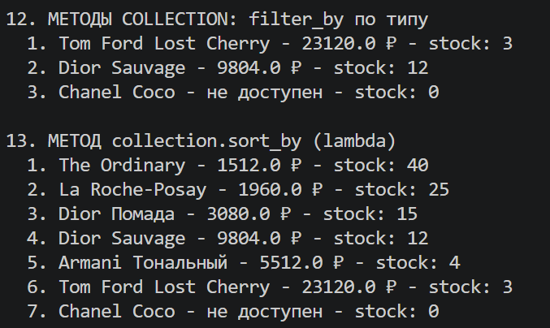

# Лабораторная работа №5 — Функции как аргументы. Стратегии и делегаты.

## 1. Цель работы

Освоить передачу функций как аргументов в другие функции и методы. 
Научиться применять встроенные функции высшего порядка: map, filter, sorted. 
Понять концепцию паттерна «Стратегия» и реализовать его на Python. 
Освоить lambda-выражения и их практическое применение. 
Интегрировать функциональный стиль с объектно-ориентированным кодом из предыдущих лабораторных работ.

## 2. Реализованные функции и стратегии

### Стратегии сортировки

 `by_name` - Сортировка по названию (алфавитный порядок) 
 `by_price` - Сортировка по цене (от дешёвых к дорогим) 
 `by_stock` - Сортировка по количеству на складе 
 `by_discount` - Сортировка по размеру скидки 
 `by_name_then_price` - Сортировка по двум атрибутам: название, затем цена 
 `by_category_then_price` - Сортировка по категории, затем по цене-

### Функции-фильтры
 `is_available` - Товар есть в наличии (stock > 0) 
 `is_active` - Товар активен 
 `has_discount` - Товар имеет скидку 
 `is_perfume` - Товар является парфюмом 
 `is_skincare` - Товар является уходом за кожей 
 `is_makeup`- Товар является макияжем 

### Фабрики функций (замыкания)
 `make_price_filter(max_price)` - Создаёт фильтр товаров по максимальной цене 
 `make_stock_filter(min_stock)` - Создаёт фильтр товаров по минимальному остатку 
 `make_discount_applier(percent)` - Создаёт функцию для применения скидки 

### Callable-объекты (паттерн Стратегия)

| Класс | Назначение |
|-------|------------|
| `DiscountStrategy` | Стратегия применения скидки к товарам |
| `PriceDisplayStrategy` | Стратегия отображения цены |
| `StatusReportStrategy` | Стратегия генерации отчёта о статусе товара |

### Новые методы коллекции
 `sort_by(key_func, reverse)` - Сортировка по переданной функции-ключу 
 `filter_by(predicate)` - Фильтрация по предикату (возвращает новую коллекцию) 
 `apply(func)` - Применение функции ко всем элементам 
 `map_to(func)` - Преобразование в список результатов 

## 3. Демонстрация работы

### Сценарий 1: Сортировка тремя разными стратегиями

### Сценарий 2: Фильтрация двумя разными функциями-фильтрами

### Сценарий 3: Применение map и фабрики функций

### Сценарий 4: Цепочка операций

### Сценарий 5: Callable-объект как стратегия

### Сценарий 6: Методы sort_by и filter_by коллекции

