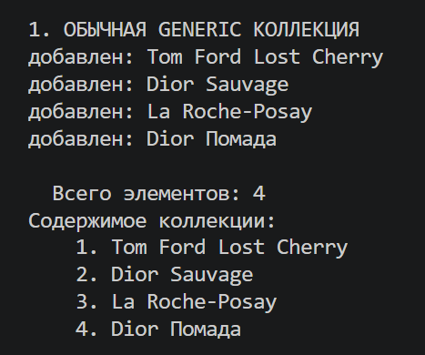
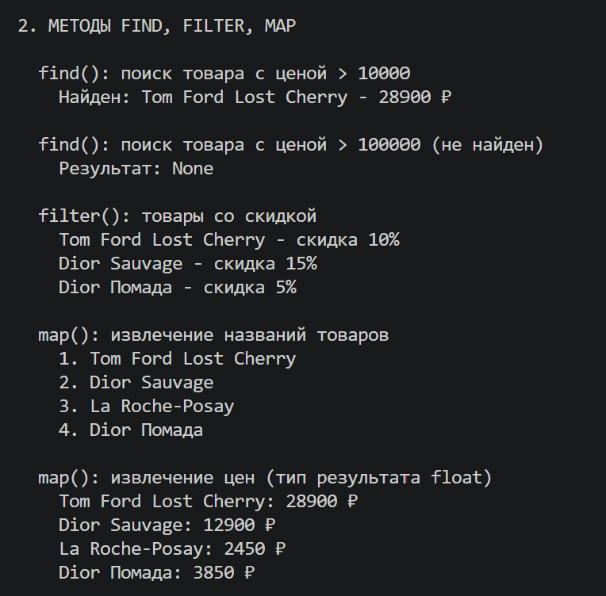
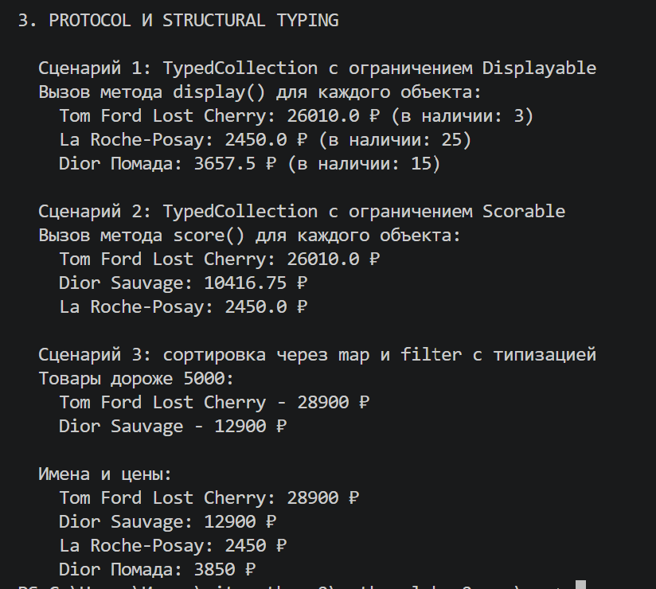

# Лабораторная работа №6 — Generics и typing

## 1. Цель работы

Освоить систему аннотаций типов в Python (typing). 
Научиться создавать обобщённые (generic) классы с помощью TypeVar и Generic. 
Понять концепцию структурной типизации через typing.Protocol.

## 2. Описание реализованных типов и контейнеров

### Generic класс TypedCollection

**Generic класс TypedCollection**

Это обобщённая коллекция, которая хранит элементы одного типа. Тип указывается при создании: `TypedCollection[Product]` или `TypedCollection[Perfume]`.

Основные методы с аннотациями типов:

- `add(self, item: T) -> None` — добавляет элемент
- `remove(self, item: T) -> None` — удаляет элемент
- `remove_at(self, index: int) -> T` — удаляет по индексу и возвращает элемент
- `get_all(self) -> list[T]` — возвращает копию списка
- `find(self, predicate: Callable[[T], bool]) -> Optional[T]` — ищет первый подходящий элемент
- `filter(self, predicate: Callable[[T], bool]) -> list[T]` — возвращает список подходящих элементов
- `map(self, transform: Callable[[T], R]) -> list[R]` — применяет функцию к элементам, возвращает список другого типа

**TypeVar**

- `T` — базовый тип без ограничений
- `D` — ограничен протоколом `Displayable` (только объекты с методом `display()`)
- `S` — ограничен протоколом `Scorable` (только объекты с методом `score()`)
- `R` — для результатов map (может отличаться от исходного типа)

**Protocol**

Протоколы реализуют структурную типизацию — классу не нужно наследоваться, достаточно иметь нужные методы.

- `Displayable` — требует метод `display() -> str`
- `Scorable` — требует метод `score() -> float`

Классы не наследуются от этих протоколов. Протокол проверяет только наличие методов.

## 3. Демонстрация работы

### Сценарий 1: Обычная Generic коллекция 

### Сценарий 2: Методы find, filter, map

### Сценарий 3: Protocol и структурная типизация 

## 4. Вывод

В ходе выполнения лабораторной работы были изучены:

1. **Аннотации типов** (помогают читать код и находить ошибки на этапе написания)
2. **Generic и TypeVar** (позволяют создавать классы, работающие с разными типами)
3. **Protocol** (реализует структурную типизацию)
4. **Ограничения bound** (гарантируют, что у элементов коллекции есть нужные методы)

