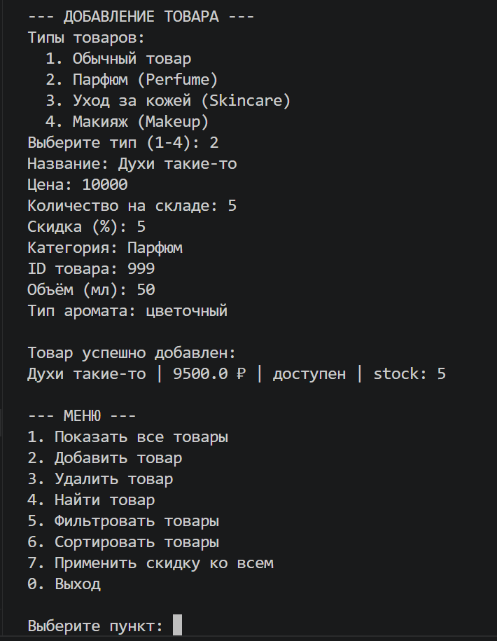
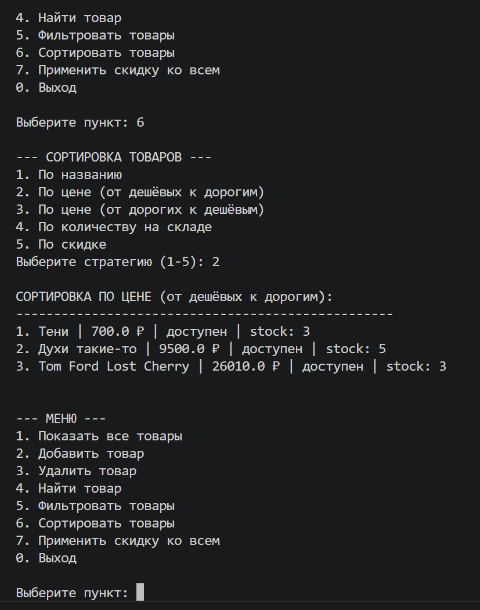
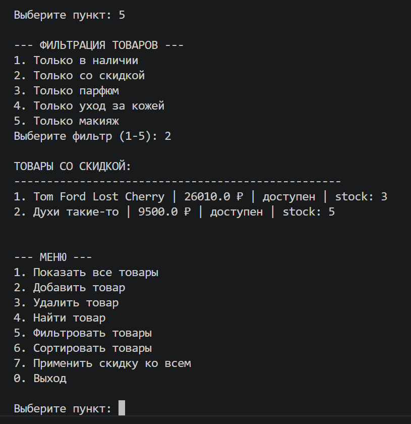

# Лабораторная работа №7 — Консольное приложение

## 1. Цель работы

Объединить все знания, полученные в ЛР1–ЛР6, в единое работающее приложение

Реализовать интерактивный CLI-интерфейс с меню и вводом пользователя

## 2. Структура проекта
main.py       - точка входа, запуск CLI

cli.py        - интерфейс: меню, ввод, вывод

app.py        - бизнес-логика, управление данными

exceptions.py - собственные исключения

storage.py    - сохранение/загрузка данных

## 3. Описание CLI

### Пункты меню

1. Показать все товары
2. Добавить товар
3. Удалить товар
4. Найти товар
5. Фильтровать товары
6. Сортировать товары
7. Применить скидку ко всем
0. Выход

### Обработка ошибок ввода

- Некорректный пункт меню → сообщение об ошибке
- Ввод строки вместо числа → запрос повторного ввода
- Пустые или некорректные значения → сообщение об ошибке

### Сохранение и загрузка

- При запуске данные автоматически загружаются из `products.json`
- При добавлении/удалении/изменении данные сохраняются
- При выходе подтверждение сохранения

## 4. Демонстрация работы

### Сценарий 1: Добавление 

### Сценарий 2: Сортировка с выбором стратегии

### Сценарий 3: Фильтрация 

